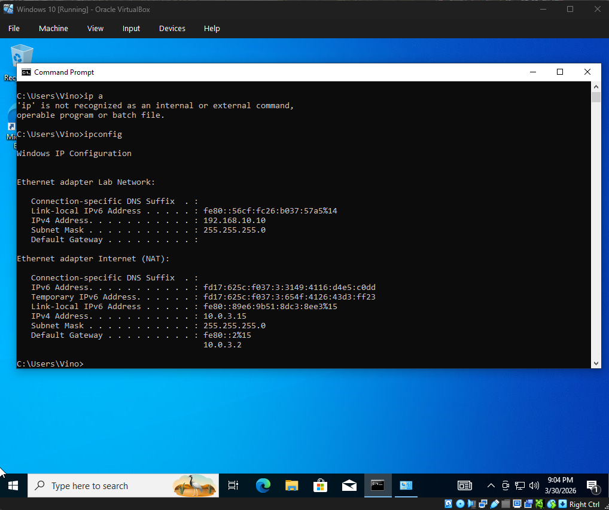
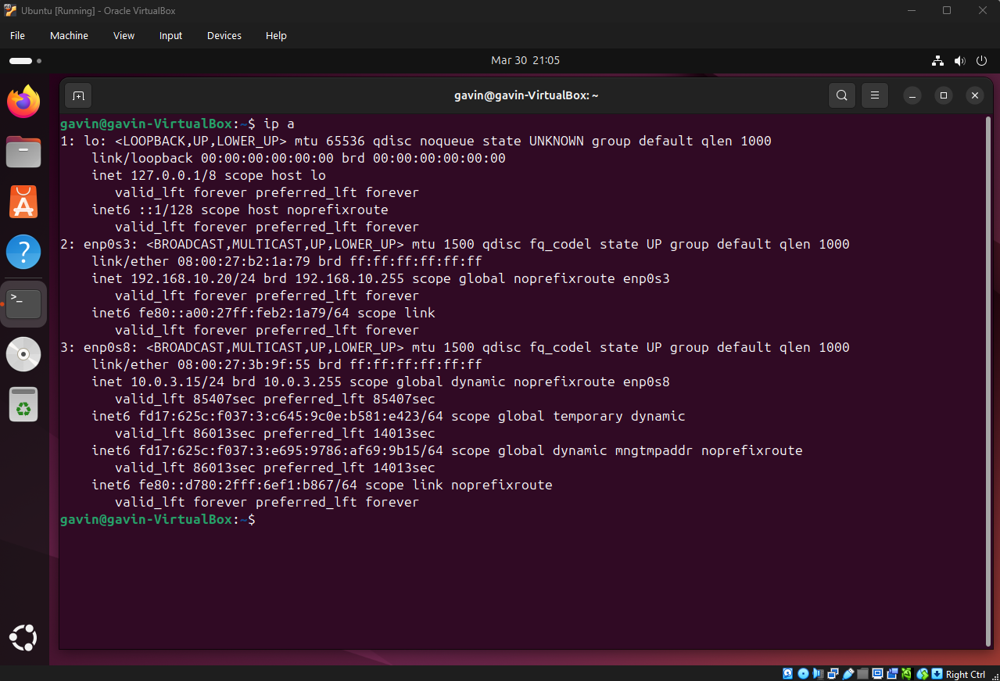
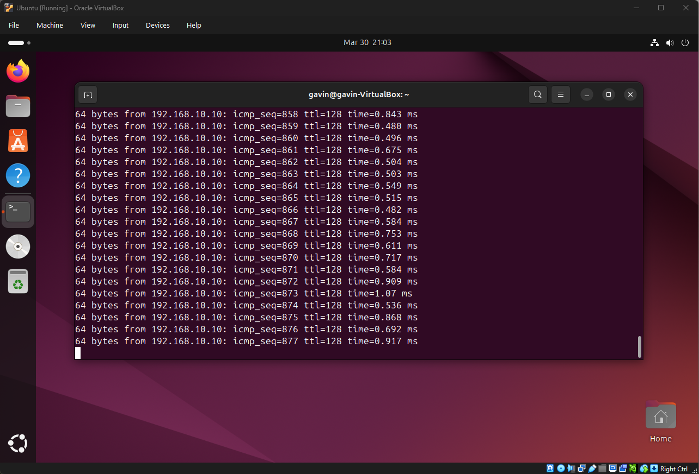

# Home Lab Network

I built a small home lab network using a Windows VM and an Ubuntu VM in VirtualBox.

## What I did
- Set up Windows and Ubuntu virtual machines
- Connected both to the same internal network
- Assigned static IP addresses
- Tested connectivity with ping

## IP addresses
- Windows: 192.168.10.10
- Ubuntu: 192.168.10.20

## Screenshots

### Windows IP Config

### Ubuntu IP Config

### Ping Test

